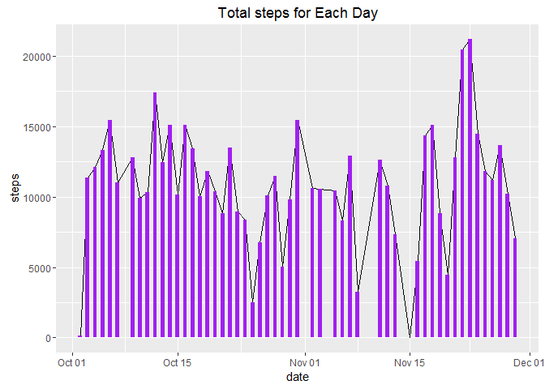
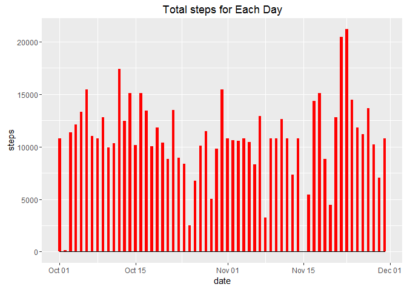
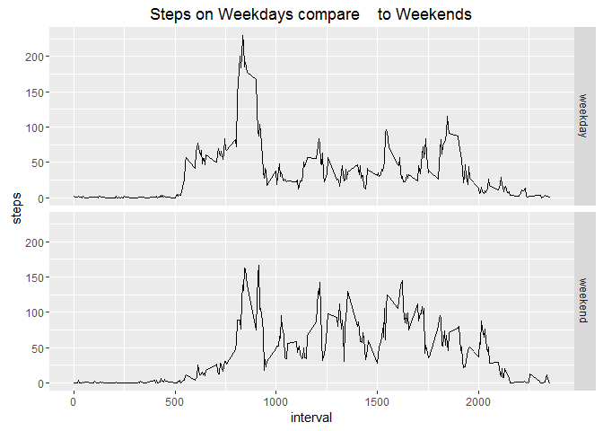

# Reproducible Research:Peer Assessment 1
Catherine O'Neill  
April 9, 2016  

# Reproducible Research: Peer Assessment 1


```r
library(ggplot2)
```

## Loading and preprocessing the data
##### 1. Load the data (i.e. read.csv())

```r
if(!exists("ActivityData")){ 
       ActivityData <- read.csv("activity.csv")
     } 
activityData <- read.csv('activity.csv')
```
##### 2. Process/transform the data (if necessary) into a format suitable for your analysis

```r
ActivityData$date<-as.Date(ActivityData$date)
noNAs <- na.omit(ActivityData)
```

-----

## What is mean total number of steps taken per day?

```r
sumdata <- aggregate(steps ~ date, noNAs, sum)
```

##### 1. Make a histogram of the total number of steps taken each day

```r
## Histogram of total steps for each day   
   g <- ggplot(sumdata, aes(date, steps)) 
   g <- g + geom_line() + ggtitle('Total steps for Each Day')   +
        geom_bar(stat="identity",fill="purple",width=0.50)
   print(g)
```



##### 2. Calculate and report the mean and median total number of steps taken per day

```r
MeanSteps <- mean(noNAs$steps)
MedianSteps <- median(noNAs$steps)
```
* Mean: `MeanSteps`
* Median:  `MedianSteps`

-----

## What is the average daily activity pattern?

```r
avgstepsinterval <- aggregate(steps ~ interval, noNAs, mean)
```

##### 1. Make a time series plot

```r
   g <- ggplot(avgstepsinterval, aes(interval,steps)) 
   g <- g + geom_line() + ggtitle('Average Number of Steps per Interval')   
   print(g)
```


##### 2. Which 5-minute interval, on average across all the days in the dataset, contains the maximum number of steps?

```r
MostStepsInterval <- avgstepsinterval[which.max(avgstepsinterval$steps),1] 
```

* Most Steps at: `MostStepsInterval`

----

## Imputing missing values
##### 1. Calculate and report the total number of missing values in the dataset 

```r
NumOfNAs <- sum(is.na(ActivityData$steps))
```

* Number of missing values: `NumOfNAs`

##### 2. Devise a strategy for filling in all of the missing values in the dataset.
##### 3. Create a new dataset that is equal to the original dataset but with the missing data filled in.

```r
CompleteData <- transform(ActivityData, steps = ifelse(is.na(ActivityData$steps),avgstepsinterval$steps[match(ActivityData$interval, avgstepsinterval$interval)], ActivityData$steps)) 
```


##### 4. Make a histogram of the total number of steps taken each day 

```r
   ## Histogram of total steps for each day with complete data    
   g <- ggplot(CompleteData, aes(date, steps)) 
   g <- g + geom_line() + ggtitle('Total steps for Each Day')   +
       geom_bar(stat="identity",fill="red",width=0.50)
   print(g)
```



##### ... and Calculate and report the mean and median total number of steps taken per day. 

```r
CompleteMeanSteps <- mean(CompleteData$steps)
CompltedMedianSteps <- median(CompleteData$steps) 
```
* Mean (Imputed): `CompleteMeanSteps`
* Median (Imputed):  `CompltedMedianSteps`


----

## Are there differences in activity patterns between weekdays and weekends?
##### 1. Create a new factor variable in the dataset with two levels – “weekday” and “weekend” indicating whether a given date is a weekday or weekend day.


```r
   CompleteData <- data.frame(date=CompleteData$date, 
                              weekday=tolower(weekdays(CompleteData$date)), 
                              steps=CompleteData$steps, 
                              interval=CompleteData$interval)

   CompleteData <- cbind(CompleteData, 
                         daytype=ifelse(CompleteData$weekday == "saturday" | 
                                            CompleteData$weekday == "sunday", "weekend", 
                                        "weekday"))

   CDsum <- aggregate(steps~interval + daytype,data=CompleteData, mean)
```

##### 2. Make a panel plot containing a time series plot


```r
   g <- ggplot(CDsum, aes(interval,steps)) + geom_line() + ggtitle('Steps on Weekdays compare    to Weekends') + facet_grid(daytype ~ .) 
       
   print(g)
```


